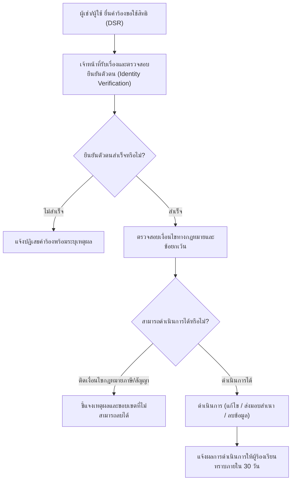

# นโยบายการเก็บรักษาข้อมูลและขั้นตอนการขอใช้สิทธิของเจ้าของข้อมูล (Data Retention & DSR Workflow)
**ระบบบริหารจัดการหอพักภัทร์ลดา อพาร์ตเมนต์ (Phatlada Apartment)**

**วันที่มีผลบังคับใช้:** 19 กันยายน 2569  
**เวอร์ชัน:** 1.0

---

## 1. ตารางระยะเวลาการเก็บรักษาข้อมูล (Data Retention Schedule)

| ประเภทข้อมูล | วัตถุประสงค์ | ระยะเวลาการจัดเก็บ | การดำเนินการเมื่อพ้นกำหนด |
| :--- | :--- | :---: | :--- |
| **ข้อมูลผู้เช่าและสัญญาเช่า** | จัดการสัญญาเช่าและห้องพัก | ตลอดอายุสัญญา + 5 ปี | ลบออกจากฐานข้อมูลอย่างปลอดภัย |
| **ประวัติการเงิน/ใบแจ้งหนี้/ใบเสร็จ** | ทำบัญชีและภาษีตามกฎหมาย | 5 – 10 ปี (ตามกฎหมายภาษี) | ลบข้อมูลระบุตัวตน (Anonymization) หรือลบถาวร |
| **ข้อมูลการแจ้งซ่อม** | ตรวจสอบประวัติบำรุงรักษาห้อง | 3 ปีนับจากปิดงานซ่อม | ลบข้อมูล |
| **ข้อมูลผู้ติดต่อสอบถามทั่วไป** | ตอบข้อซักถามและจองห้องพัก | 1 ปี | ลบข้อมูลอัตโนมัติ |
| **Audit Logs และข้อมูลเซสชัน** | ตรวจสอบความปลอดภัยระบบ | 90 วัน – 1 ปี | ลบ Log อัตโนมัติ (Log Rotation) |

---

## 2. ขั้นตอนการยื่นคำร้องขอใช้สิทธิของเจ้าของข้อมูล (Data Subject Request Workflow)

---

## 3. รายละเอียดสิทธิและกรอบเวลาการดำเนินการ (ภายใน 30 วัน)

1. **สิทธิขอเข้าถึงและขอรับสำเนาข้อมูล (Right of Access):**
   - ผู้เช่าสามารถขอรับสำเนาประวัติการเช่า ใบเสร็จรับเงิน หรือข้อมูลส่วนบุคคลของตนเองได้
2. **สิทธิขอแก้ไขข้อมูลให้ถูกต้อง (Right to Rectification):**
   - ผู้เช่าสามารถแจ้งเปลี่ยนเบอร์โทรศัพท์ อีเมล หรือที่อยู่ติดต่อได้ตลอดเวลา
3. **สิทธิขอลบหรือทำลายข้อมูล (Right to Erasure):**
   - สามารถขอลบข้อมูลได้หลังจากสิ้นสุดสัญญาเช่าและชำระค่าใช้จ่ายทั้งหมดแล้ว (ยกเว้นเอกสารทางภาษีที่ต้องเก็บตามกฎหมาย)
4. **สิทธิขอถอนความยินยอม (Right to Withdraw Consent):**
   - สามารถถอนความยินยอมในการรับข่าวสารประชาสัมพันธ์หรือคุกกี้ได้ทันที

---

## 4. ช่องทางยื่นคำร้อง
- **อีเมล:** chetnarak2531@gmail.com
- **โทรศัพท์:** 087-188-9122
- **การตอบกลับ:** ทีมงานจะพิจารณาและแจ้งผลภายใน **30 วัน** นับแต่วันที่ได้รับคำร้องขอที่ครบถ้วนและยืนยันตัวตนแล้ว

